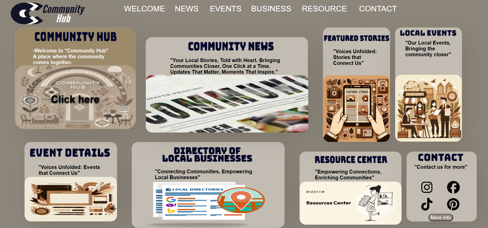
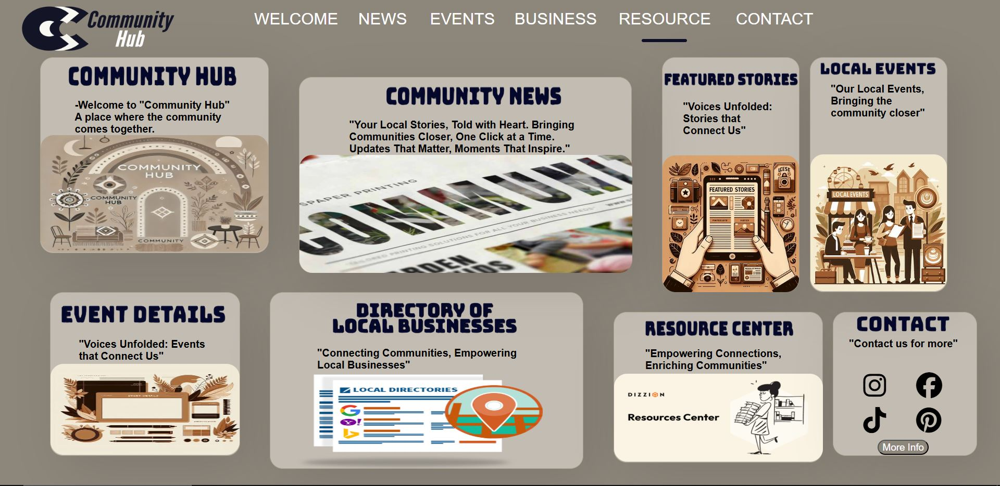
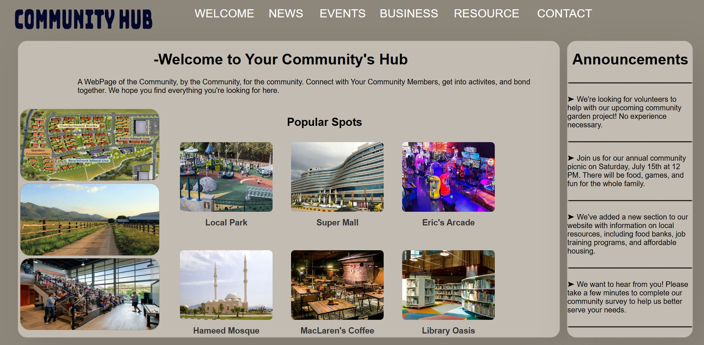
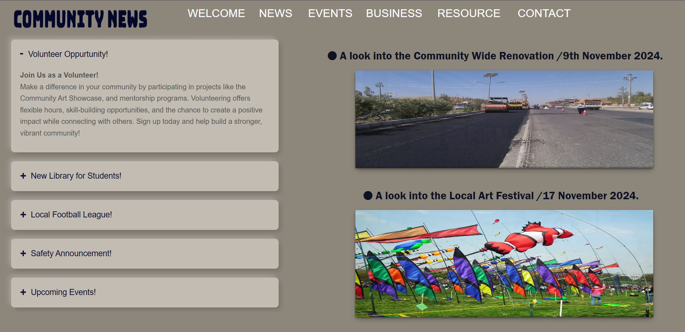
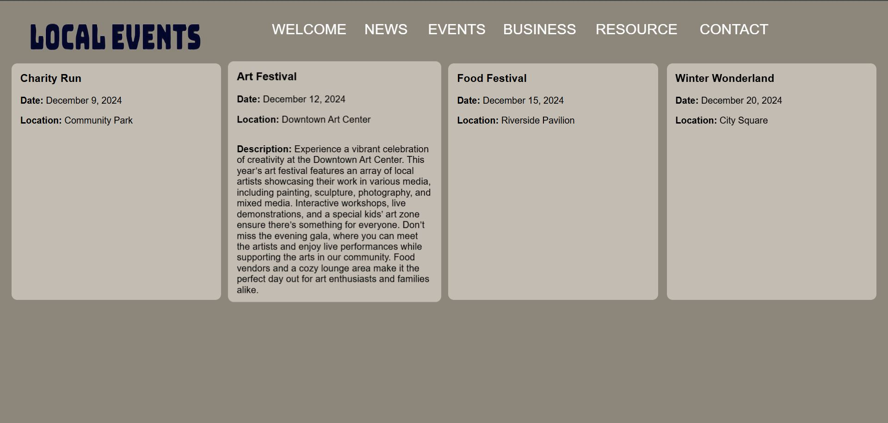
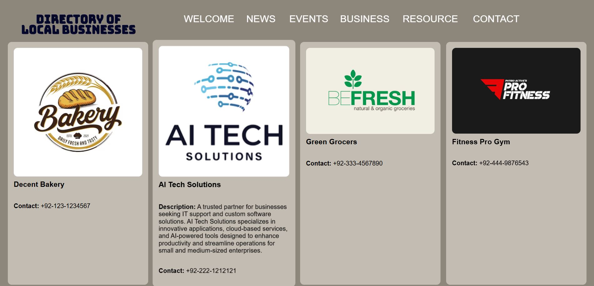
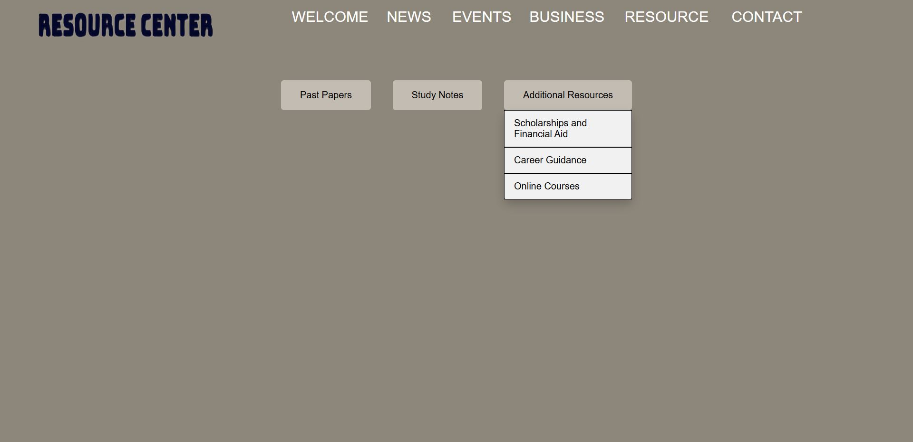
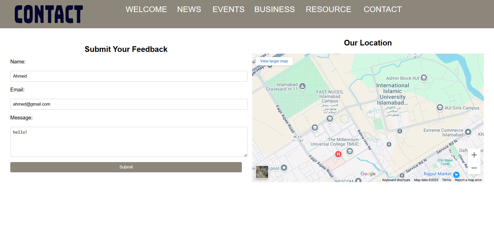

# Community Hub

A **Beginner-Level** responsive, multi-page HTML/CSS website that brings together local resources, events, businesses and community news.

> **Note:** This website is optimized for display when your browser zoom level is set to **100%** (e.g., in Google Chrome). The layout and sizing of elements such as divs have been tailored for this scale to ensure the best user experience.

---

## Table of Contents

1. [Welcome Page](#welcome-page)  
2. [Community News](#community-news)  
3. [Local Events](#local-events)  
4. [Directory of Local Businesses](#directory-of-local-businesses)  
5. [Resource Centre](#resource-centre)  
6. [Contact & Feedback](#contact--feedback)  

---

## Main Page

**File:** `index.html` (landing section)  
**Stylesheet:** `main.css`

- **Purpose:**  
  - Introduces the Community Hub platform and guides visitors to each section.  
  - Displays featured spots and recent announcements.  
  - Provides the top navigation bar linking all pages.

- **Design & Layout:**  
  - Dark brown background (`background-color: #8d867b`) with lighter “creamy” containers.  
  - Modern sans-serif fonts in black for headings and body text.  
  - Rounded buttons with smooth CSS transitions on hover.


- **Key HTML/CSS Features:**  

  - **Navigation (`nav`):**  
    - `float: left; position: relative; width: 900px; height: 60px;`  
    - Children `.navv` links (uppercase, `font-size: 25px`) and a sliding `.animation` bar with `transition: all 0.4s ease-in-out;`.  





  - **Hero Cards (`.com_hub`, `.com_new`, etc.):**  
    - Fixed dimensions, `border-radius: 20px`, `box-shadow` for depth.  
    - Hover effects: `.com_hub:hover .com_hub_pic { filter: blur(1px); transform: scale(1.08); }` and reveal overlay text via `opacity` transitions.  
  - **Social & Contact Icons:**  
    - Font-Awesome icons (`.fa-instagram`, `.fa-facebook`, etc.) with hover color transitions.  
    - “More Info” button styled with `border-radius: 15px` and `background-color: #8d867b`.

---

## Welcome Page

**File:** `com_hub.html`  
**Stylesheet:** `main.css`  



- **Purpose:**  
  Introduces visitors to the Community Hub platform, showcases featured spots and recent announcements, and provides the primary navigation menu linking to all other pages.

- **Design & Layout:**  
  - Dark brown background (`#8d867b`) with lighter “creamy” content containers (`#c2bcb2`).  
  - Modern sans-serif fonts in black for high readability.  
  - Rounded buttons and interactive hover transitions for a polished look.

- **Key HTML/CSS Features:**   
  - Floating navigation bar (900 px × 60 px) with sliding underline on hover.  
  - Featured cards styled with shadows, rounded corners, hover blur effects, and overlay text.  
  - Flexbox layout for even spacing of hero sections.  
  - Social media icons and “More Info” button with smooth CSS transitions.

---

## Community News

**File:** `com_new.html`  
**Stylesheet:** `com_new.css`

- **Purpose:**  
  - Reports current community affairs and announcements.  
  - Allows visitors to expand/collapse articles and browse image carousels.

- **Design & Layout:**  
  - Consistent brown/cream palette.  
  - Bold sans-serif headings for emphasis.  
  - Animated accordion sections and carousel slider.



- **Key HTML/CSS Features:**  

  - **Global Reset:**  
    ```css
    * { margin: 0; padding: 0; box-sizing: border-box; }
    ```
  - **Accordion (`input[type="radio"]` + `.content`):**  
    - `max-height` and `padding` animated with `transition: max-height 0.5s, padding 0.5s;`.  
    - `label::before` toggles from “+” to “–”.  
  - **Carousel:**  
    - Horizontal sliding images with `overflow: hidden` and `white-space: nowrap`.

---

## Local Events

**File:** `localevents.html`  
**Stylesheet:** `events.css`

- **Purpose:**  
  - Lists upcoming community activities with date, venue, and descriptions.

- **Design & Layout:**  
  - Hover on event cards reveals full details without scrolling.  
  - Uppercase navigation links in white (`text-transform: uppercase; color: white;`).




- **Key HTML/CSS Features:**  

  - **Hover Animations:**  
    ```css
    .event-card:hover .details {
      opacity: 1;
      transform: translateY(0);
      transition: all 0.3s ease-in-out;
    }
    ```
  - **Navigation Bar:**  
    - Sliding `.animation` bar beneath links on hover.  
    - Each `.navv:nth-child(n)` sets individual margins and widths.

---

## Directory of Local Businesses

**File:** `directory.html`  
**Stylesheet:** `directory.css`

- **Purpose:**  
  - Displays an alphabetically or category-sorted list of local businesses with contact details.

- **Design & Layout:**  
  - Bold section headers, alternating background shades for readability.  
  - Responsive grid or list layout.




- **Key HTML/CSS Features:**  

  - **Category Titles:**  
    ```css
    .category-header { font-weight: bold; background-color: #ac9f8b; padding: .5rem; }
    ```
  - **Hover Bar:**  
    - Same `.animation` pattern reused for consistent navigation feedback.

---

## Resource Centre

**File:** `resource.html`  
**Stylesheet:** `resources.css`

- **Purpose:**  
  - Provides organized links to study notes, past papers and other community resources via tabs.

- **Design & Layout:**  
  - Tabbed interface: `.tabs` container with `.tab` items.  
  - Smooth drop-down menus on hover.




- **Key HTML/CSS Features:**  

  - **Tab Navigation:**  
    ```css
    .tabs .tab:hover .dropdown { display: block; transition: all 0.3s ease-in-out; }
    ```
  - **Link Styling:**  
    - `<a>` elements styled as buttons with `text-decoration: none; color: #000;`.

---

## Contact & Feedback

**File:** `contact.html`  
**Stylesheet:** `contact.css`

- **Purpose:**  
  - Allows users to send feedback and view a Google Maps embed of the community location.

- **Design & Layout:**  
  - Form fields for name, email, message with CSS validation (`:invalid` states).  
  - Embedded `<iframe>` for Google Maps, positioned alongside form inputs.




- **Key HTML/CSS Features:**  

  - **Form Validation Styles:**  
    ```css
    input:invalid { border-color: red; }
    ```
  - **Layout:**  
    - Flexbox or CSS grid to align form and map side by side.

---

## How to View or Deploy

1. **Clone the repository**  
   ```bash
   git clone https://github.com/YourUsername/community-hub.git

---

## Author

* **Taha Ebaad**

> *This Website was developed as part of the Introduction to Information and Computing Technologies Final project.*
